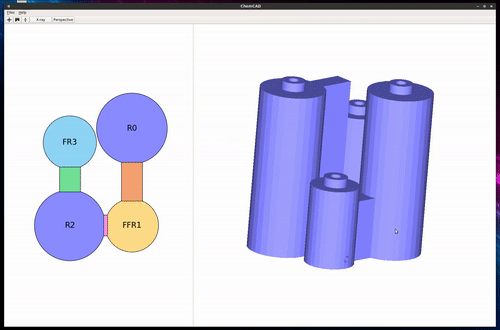

# About me

    <article>
      <dl>
        

          

            <dt>2013</dt>
            <dd>Start of PhD in chemistry</dd>
            <dd>Montpellier, France</dd>
          

        

        

          

            <dt>2016</dt>
            <dd>End of PhD in chemistry</dd>
          

        

        

          

            <dt>2017</dt>
            <dd>Postdoctoral researcher</dd>
            <dd>Glasgow, UK</dd>
          

        

        

          

            <dt>2018</dt>
            <dd>Data engineer</dd>
            <dd>Okra Technologies</dd>
            <dd>Leiden, Netherlands</dd>
          

        

        

          

            <dt>2021</dt>
            <dd>Software engineer</dd>
            <dd>Babylon Health</dd>
            <dd>London, UK</dd>
          

        

        

          

            <dt>2022</dt>
            <dd>Senior SRE</dd>
            <dd>Babylon Health</dd>
            <dd>London, UK</dd>
          

        

        

          

            <dt>2023</dt>
            <dd>Lead software engineer</dd>
            <dd>Virgin Media O2</dd>
            <dd>London, UK</dd>
          

        

      </dl>
    </article>

After obtaining my PhD in <b>2016</b>, I moved to Glasgow to join the group
of <a href="http://www.chem.gla.ac.uk/cronin">Prof. Lee Cronin</a> as a
postdoctoral research associate. I was part of the "reactionware" team,
which aims to digitize organic chemistry through, for example, 3D printed
reactors.

In <b>2018</b>, I decided to leave academia to join <a
href="https://www.okra.ai/">Okra Technologies</a>, a dynamic healthcare
start-up, as a data engineer. There, I built analytics engines for healthcare
companies. My main responsibilities were the development of backend services
and the development of Okra's data lake. In 2023,
Okra was acquired by Envision Pharma.

In <b>2021</b>, I joined <a href="https://www.babylonhealth.com/en-gb">Babylon
Health</a> as a Software Engineer. I was ensuring the high availability and
quality of medical data to improve the output of Babylon's AI models. I was
also working on a set of microservices to validate the safety of these
models. Once these models were considered safe - any healthcare environment
is extremely regulated! - I deployed these models into production, where they
would help improve the health of our patients. 

In <b>2022</b>, I joined Babylon's <b>Site Reliability Engineering</b>
(SRE) team, as a senior software engineer. My responsibilities ranged
from being on-call 24/7 to respond to incidents, to maintaining Babylon's
infrastructure. I also helped developers scale their applications and make
sure they worked reliably in production.

In <b>2023</b>, I left the healthcare field behind to join the Telco world:
I joined <a href="https://news.virginmediao2.co.uk/">Virgin Media O2</a>. I'm
still a software engineer, and I'm now leading a team tasked with creating
a "fault platform". This platform aims to detect and remediate faults on
VMO2's network.

# Selected Publications

- [Automatic Generation of 3D Printed Reactionware for Chemical Synthesis
Digitization using ChemSCAD](https://pubs.acs.org/doi/10.1021/acscentsci.0c01354)
W. Hou, A. Bubliauskas, P. J. Kitson, JP. Francoia, H. Powell-Davies,
JM Parrilla Gutierrez, P. Frei, J.S Manzano and L. Cronin, *ACS Cent. Sci.*,
2020, **DOI**:&nbsp;10.1021/acscentsci.0c01354 - open access  

  

- [Digitization of multistep organic synthesis in reactionware for on-demand
pharmaceuticals](http://science.sciencemag.org/content/359/6373/314)  
P. J. Kitson, G. Marie, J.-P. Francoia, S. S. Zalesskiy, R. C. Sigerson,
J. S. Mathieson and L. Cronin *Science*, 2018, **359**, 314  
**Video:** [https://www.youtube.com/watch?v=0Uc76tzNmtM&feature=youtu.be](https://www.youtube.com/watch?v=0Uc76tzNmtM&feature=youtu.be)

  

- [ChemBrows: An Open-Source Application Software To Keep Up to Date with the Current Literature](http://pubs.acs.org/doi/abs/10.1021/acs.jchemed.6b00024)  
J.-P. Francoia and L. Vial, *J. Chem. Educ*, 2016, **93**, 1137 - open access  
**Website:** [github.com/chembrows/ChemBrows](https://github.com/chembrows/ChemBrows)

  

 

You can access the full list of my publications [here]({{ site.url }}/publications)
