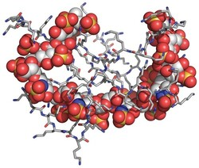
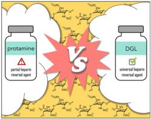
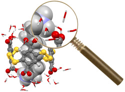
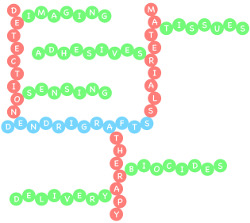
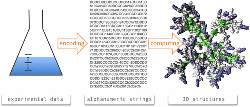
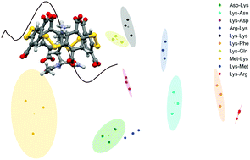
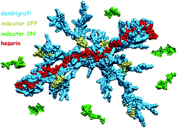
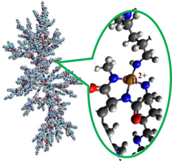

# Publications

- [Interview C&EN: Polymer could be a broader heparin blocker (by Louisa
Dalton)](https://cen.acs.org/pharmaceuticals/drug-development/Polymer-broader-heparin-blocker/97/web/2019/06?utm_source=Staff&utm_medium=Social&utm_campaign=CEN)

  

- [Dendrigraft of Poly-*L*-lysine as a Promising
Candidate To Reverse Heparin-based Anticoagulants in Clinical
Settings](https://pubs.acs.org/doi/abs/10.1021/acsmedchemlett.9b00090)
B. Ourri, J.-P. Francoia, G. Monard, J.-C. Gris, J. Leclaire, and L. Vial,
*ACS Med. Chem. Lett.*, 2019, **10**, 917. citation:
2  

  

- [Wetting the lock and key enthalpically favours polyelectrolytes binding](https://pubs.rsc.org/en/Content/ArticleLanding/2018/SC/C8SC02966K)  
E. Jeamet, J. Septavaux, A. Héloin, M. Donnier-Maréchal, M. Dumartin,
B. Ourri, P. K. Mandal, I. Huc, E. Bignon, E. Dumont, C. Morell,
J.-P. Francoia, F. Perret, L. Vial and J. Leclaire *Chem. Sci.*, 2019, **10**,
277  

  

- [Digitization of multistep organic synthesis in reactionware for on-demand
pharmaceuticals](http://science.sciencemag.org/content/359/6373/314)  
P. J. Kitson, G. Marie, J.-P. Francoia, S. S. Zalesskiy, R. C. Sigerson,
J. S. Mathieson and L. Cronin *Science*, 2018, **359**, 314. citations: 58  
**Video:** [https://www.youtube.com/watch?v=0Uc76tzNmtM&feature=youtu.be](https://www.youtube.com/watch?v=0Uc76tzNmtM&feature=youtu.be)

  

- [Everything you always wanted to know about poly-*L*-lysine dendrigrafts (but were afraid to ask)](http://onlinelibrary.wiley.com/wol1/doi/10.1002/chem.201704147/abstract)  
J.-P. Francoia and L. Vial, *Chem. Eur. J.*, 2017, **24**, 2806 - citations: 5  

  

- [Digitizing Poly-*L*-Lysine Dendrigrafts: from Experimental Data to Molecular Dynamics Simulations](http://pubs.acs.org/doi/pdf/10.1021/acs.jcim.7b00258)  
J.-P. Francoia, J.-C Rossi, G. Monard and L. Vial, *J. Chem. Inf. Model.*,
2017, **57**, 2173 - citations:&nbsp;6  

  

- [Chirality Sensing and Discrimination of Lysine Derivatives in Physiological Conditions with a Dyn\[4\]arene](http://pubs.rsc.org/en/content/articlelanding/2016/cc/c6cc07713g)  
L. Vial, M. Dumartin, M. Donnier-Maréchal, F. Perret, J.-P. Francoia,
J. Leclaire, *Chem. Commun.*, 2016, **52**, 14219 - citation: 2  

  

- [ChemBrows: An Open-Source Application Software To Keep Up to Date with the Current Literature](http://pubs.acs.org/doi/abs/10.1021/acs.jchemed.6b00024)  
J.-P. Francoia and L. Vial, *J. Chem. Educ*, 2016, **93**, 1137 - open access, citation: 1  

  

- [A KISS (Keep It Simple, Sensor) Array for Glycosaminoglycans](http://pubs.rsc.org/en/content/articlelanding/2014/cc/c5cc07628e\#!divAbstract)  
J.-P. Francoia and L. Vial, *Chem. Commun.*, 2015, **51**, 17544 - citations: 10  

  

- [Monitoring Clinical Levels of Heparin in Human Blood Samples with an Indicator-Displacement Assay](http://pubs.rsc.org/en/Content/ArticleLanding/2015/CC/c4cc08563a\#!divAbstract)  
J.-P. Francoia, R. Pascal, and L. Vial, *Chem. Commun.*, 2015, **51**,
1953 - citations: 18  

  

- [A Double Conformationally Restricted Dynamic Supramolecular System for the Substrate-Selective Epoxidation of Olefins—A Comparative Study on the Influence of Preorganization](http://onlinelibrary.wiley.com/doi/10.1002/cctc.201402726/full)  
E. Lindbäck, S. Cherraben, J.-P. Francoïa, E. Sheibani, B. Lukowski,
A. Proñ, H. Norouzi-Arasi, K. Månsson, P. Bujalowski, A. Cederbalk,
T. H. Pham, T. Wixe, S. Dawaigher and K. Wärnmark, *ChemCatChem*, 2015,
**7**, 333 - citation: 1  

- [Multi-Technique Characterization of Poly-L-lysine Dendrigrafts–Cu(II) Complexes for Biocatalysis](http://onlinelibrary.wiley.com/doi/10.1002/mabi.201400341/abstract)  
J.-C. Rossi, B. Maret, K. Vidot, J.-P. Francoia, M. Cangiotti, S. Lucchi,
C. Coppola, and M. F. Ottaviani, *Macromol. Biosci.*, 2015, **15**, 275 - citations: 9  

  

## My Ph. D thesis

- Le principe KISS appliqué à la conception de senseurs et à la veille
    bibliographique: [\[PDF\]]({{ site.baseurl }}/attached/thesis.pdf)

# Conferences

Slides and posters available [here](https://github.com/JPFrancoia/PostersSlides)

- **Welcome Genome Campus Hackathon 2018**, *Hinxton*, United Kingdom  
Medicine Discovery Catapult's challenge:  
*How can we combine drug and genetic data to intelligently prescribe drugs?*

- **RSC Twitter Poster Conference 2018**, *Twitter*, World  
Poster presentation

- **JMJC 2016 (Journées Méditerranéennes des Jeunes Chercheurs)**, *Nice*, France  
Poster presentation

- **MSMLG 2016 (Molecular Sensors and Molecular Logic Gates)**, *Bath*, United Kingdom  
Oral presentation and poster presentation

- **JMJC 2015 (Journées Méditerranéennes des Jeunes Chercheurs)**, *Montpellier*, France  
Oral presentation

- **MeMoSim 2015 (Modeling Methods and multiscale Simulations)**, *Lyon*, France  
Poster presentation

- **Balard Chemistry Conferences 2014**, *La Grande Motte*, France  
Poster presentation

- **JJC 2014 (Journées des Jeunes Chercheurs)**, *Montpellier*, France  
Poster presentation
